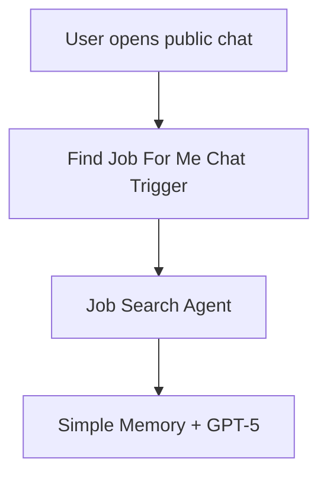
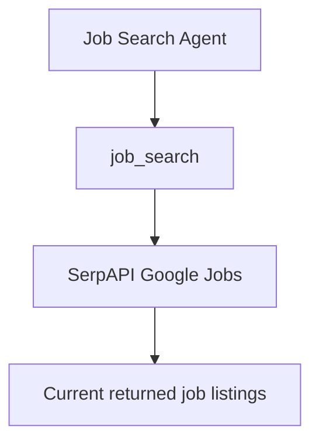
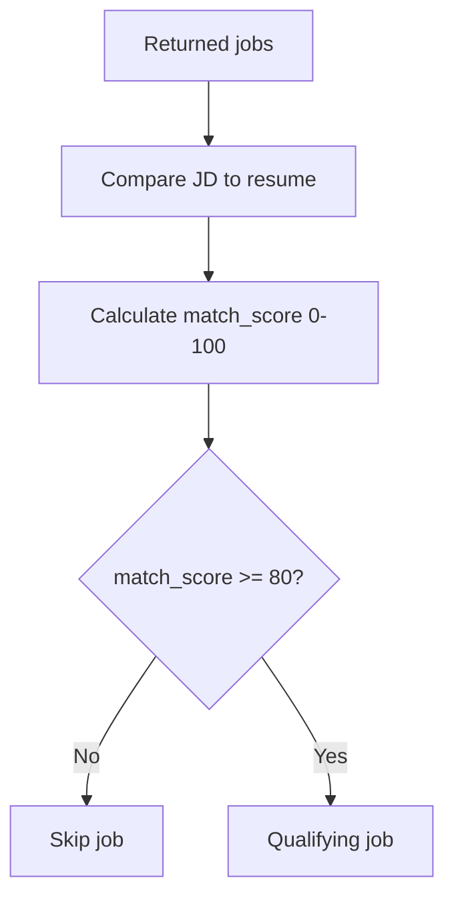
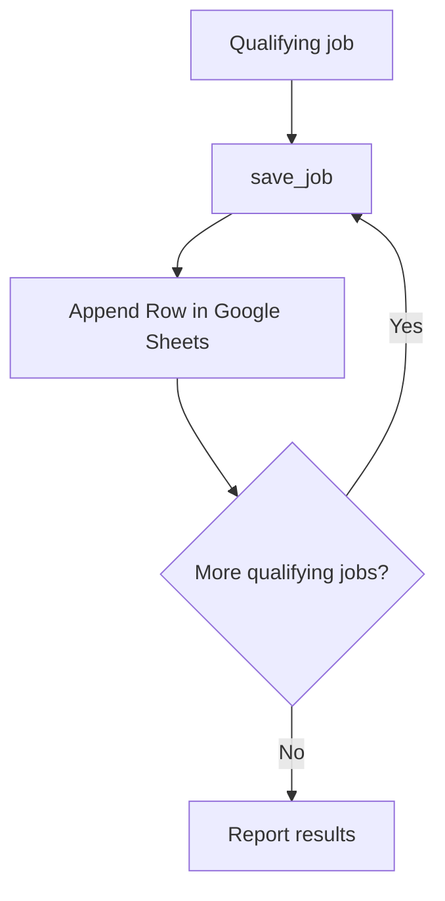
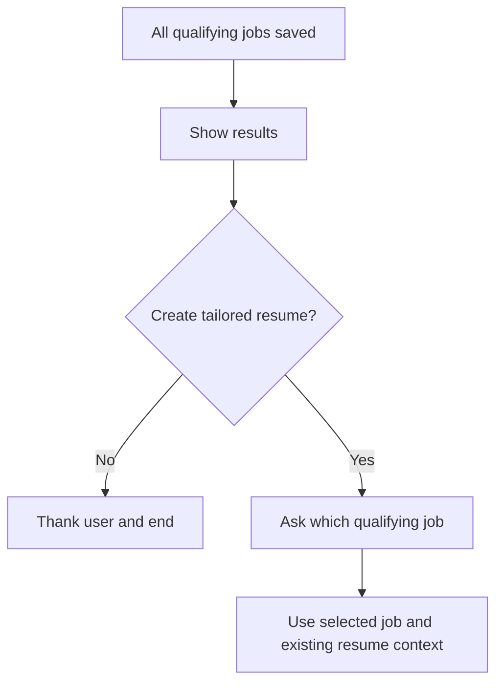

# AI Job Search Agent — Business Requirements & Implementation Guide

> **Status:** Final documented workflow snapshot for public GitHub sharing  
> **Platform:** n8n  
> **LLM:** OpenAI GPT-5  
> **Job source:** SerpAPI Google Jobs  
> **Results store:** Google Sheets  
> **Default match threshold:** 80%

## Author

**Muhammad N Sair**  
**Contact:** NaumanSair@outlook.com | www.linkedin.com/in/muhammad-sair


## What is this Agent?

The **AI Job Search Agent** is a conversational n8n workflow that searches current job opportunities, compares returned job descriptions with a user's resume, identifies jobs meeting a configured match threshold, saves qualifying jobs to Google Sheets, reports the matches in chat, and then asks whether the user wants a tailored resume.

The final workflow contains these primary components:

- **Find Job For Me** — public n8n Chat Trigger.
- **Job Search Agent** — controls the workflow sequence and tool use.
- **OpenAI Chat Model** — GPT-5 model used by the Agent.
- **Simple Memory** — keeps the latest 10 chat-context items available to the Agent.
- **job_search** — HTTP Request Tool that searches SerpAPI's Google Jobs engine.
- **save_job** — Google Sheets Tool that appends each qualifying job as a separate row.

The public chat is configured with the initial greeting:

> Hi there! 👋  
> My name is Robo-Agent. How can I assist you today?

## Agent Goal

The Agent's goal is to automate the repetitive parts of job discovery and resume-to-job comparison while leaving the final decision with the user.

The workflow is designed to:

1. Use the user's target job title, location, work arrangement, and resume.
2. Search current jobs through SerpAPI Google Jobs.
3. Compare each returned job description with the resume.
4. Calculate a match score from 0 to 100.
5. Keep only jobs with `match_score >= 80`.
6. Save every qualifying job to Google Sheets before asking about resume tailoring.
7. Report the qualifying jobs in chat.
8. Ask whether the user wants a tailored resume.
9. End the job search if the user says No, or continue with the selected job if the user says Yes.

## Summary of the Agent

### Inputs

The current workflow expects the user to provide:

- Job title
- Location
- Work arrangement
- Resume information/text

### Processing

The Agent follows this mandatory order:

1. **Search** — call `job_search` using job title, location, and work arrangement.
2. **Match** — compare returned job descriptions with the user's resume.
3. **Qualify** — retain only jobs scoring 80 or higher.
4. **Save** — call `save_job` separately for every qualifying job.
5. **Report** — show qualifying jobs and summary counts in chat.
6. **Tailored resume decision** — ask whether the user wants a tailored resume only after qualifying jobs have been saved.

### Saved output

For each qualifying job, `save_job` sends these fields to Google Sheets:

- `apply_link`
- `job_title`
- `company`
- `location`
- `match_score`
- `posted`

The current Google Sheets schema also contains `tailored_resume` and `recruiter_message`, but the current `save_job` mapping does not populate those fields.

## User interface

The current interface is an **n8n public Chat Trigger**.

The workflow is configured as public and starts with Robo-Agent's greeting.

For the most reliable use of the current JSON, the user should provide all required search information in the conversation before the search begins. For example:

```text
Find Business Systems Analyst jobs in Virginia.
Work arrangement: Remote + Hybrid.
Here is my resume:
[resume text]
```

### Important current behavior

The final JSON does not contain a separate resume-file extraction node. A PDF or DOCX parser is not part of the current workflow. Resume text in chat is therefore the safest input for this version.

## Process flows with descriptions

### Flow 1 — User starts the Agent



**Description:** The public Chat Trigger receives the user's conversation and passes it to the Job Search Agent. Simple Memory retains recent conversation context for the session.

### Flow 2 — Search current jobs



**Description:** `job_search` calls `https://serpapi.com/search.json` with `engine=google_jobs`. The search query is generated from the user's requested job title, location, and work arrangement. The resume is specifically excluded from the search-query text.

### Flow 3 — Match and qualify jobs



**Description:** The Agent compares each returned job description with the resume and applies the 80% qualification rule.

### Flow 4 — Save qualifying jobs first



**Description:** Every qualifying job must be written to Google Sheets before the Agent is allowed to ask about a tailored resume. `save_job` is called separately for each qualifying job.

### Flow 5 — Tailored resume decision



**Description:** If the user says No, the current job search ends. If the user says Yes, the Agent asks which job should be used. If there is only one qualifying job, the Agent is instructed to confirm that job instead of making the user enter it again.

The current workflow does **not** contain a DOCX-generation or downloadable-file node. Tailored resume logic is currently conversational/model-based unless another document-generation step is added.

## How to install the agent

### n8n Cloud

1. Sign in to n8n.
2. Create a new workflow.
3. Import the sanitized file `Job_Search_Agent_FINAL.public.json`.
4. Open **OpenAI Chat Model** and connect your own OpenAI API credential.
5. Open **job_search** and replace `YOUR_SERPAPI_API_KEY` with your own SerpAPI key or secure credential method.
6. Open **save_job** and connect your Google Sheets credential.
7. Replace `YOUR_GOOGLE_SHEET_ID` with your destination spreadsheet.
8. Confirm the sheet contains the columns expected by `save_job`.
9. Test the workflow from the chat interface.
10. Activate the workflow only after the test succeeds.

### Self-hosted n8n

1. Install n8n using Docker or another supported deployment option.
2. Import `Job_Search_Agent_FINAL.public.json`.
3. Configure OpenAI, SerpAPI, and Google credentials on the self-hosted instance.
4. Configure HTTPS and authentication before public exposure.
5. Test the chat, job search, matching, and Google Sheets save sequence.
6. Activate the workflow.

## How to run it

1. Open the public n8n chat URL.
2. Provide the target job title.
3. Provide the search location.
4. Provide the desired work arrangement.
5. Provide the resume text.
6. Let the Agent run `job_search`.
7. Let the Agent compare returned jobs against the resume.
8. Verify every job scoring 80% or higher is saved to Google Sheets.
9. Review the results shown in chat.
10. Answer the tailored-resume question:
   - **No** — the Agent ends the current search.
   - **Yes** — select or confirm the qualifying job to tailor against.

## what details user has to enter

| Input | Example | Required for reliable use |
|---|---|---|
| Job title | Business Systems Analyst | Yes |
| Location | Virginia / Arlington, VA / USA | Yes |
| Work arrangement | Remote / Hybrid / Onsite / combination | Yes |
| Resume | Resume text pasted into chat | Yes |

The current `job_search` tool is explicitly instructed to run after these details are available.

## how it work

At runtime:

1. The public Chat Trigger receives the user's message.
2. GPT-5 and Simple Memory provide the Agent with conversation context.
3. The Agent calls `job_search`.
4. `job_search` sends an AI-created query to SerpAPI Google Jobs.
5. The Agent evaluates returned job descriptions against the user's resume.
6. Jobs below 80% are skipped.
7. Each job at or above 80% is passed to `save_job` separately.
8. `save_job` appends a new row to Google Sheets.
9. Only after all qualifying jobs are saved does the Agent report the results and ask about tailored resume creation.

## what are the limits

### Current business/functional limits

- **Match threshold:** 80%.
- **Memory:** context window length is 10.
- **Job source:** SerpAPI Google Jobs only.
- **Model:** GPT-5 in the current workflow.
- **No explicit job-count limit:** the final JSON does not define a maximum number of jobs to evaluate.
- **No explicit posting-age filter:** the final JSON does not restrict results to 24/48 hours or another age window.
- **No duplicate check:** the workflow does not check whether the user previously applied for or saved the same job.
- **No direct LinkedIn/Indeed/Monster authentication:** the current search source is SerpAPI Google Jobs.
- **No resume-file parser:** PDF/DOCX resume extraction is not implemented.
- **No downloadable tailored resume:** the current workflow does not generate DOCX/PDF output.
- **No per-user spreadsheet isolation:** the current `save_job` node points to one configured Google Sheet destination.
- **Match scores are AI assessments:** they are not official ATS scores.
- **Job validity depends on search-provider data:** there is no separate job-page verification node.

### Platform/API limits

Actual throughput and cost depend on:

- n8n execution limits and hosting plan
- OpenAI model/API rate and usage limits
- SerpAPI search quota
- Google Sheets API/OAuth limits

## how to change the limits, if needed

### Change match threshold

Change the value in **both** places so the Agent and save tool stay consistent:

1. Job Search Agent system message:

```text
match_score >= 80
```

2. `save_job` tool description, which currently states that every job with `match_score >= 80` must be saved.

For example, change both to `85` for an 85% threshold.

### Change memory length

Open **Simple Memory** and modify:

```text
Context Window Length = 10
```

### Add a posting-age limit

Add a SerpAPI-supported date filter/query rule in `job_search`, or add a deterministic filter node after the search. The current JSON has no posting-age restriction.

### Add a maximum job count

Add the limit to the Agent instructions or, for more reliable production behavior, split returned jobs into items and use n8n looping/limit nodes.

### Change result storage

Replace `save_job` with another destination such as:

- Excel/XLSX generation
- CSV
- OneDrive/SharePoint
- Airtable
- SQL database
- another user's Google Sheet

## what are the dependencies - such as API and keys, how to change the dependencies.

### 1. n8n

**Purpose:** Chat interface, workflow orchestration, tool calling, and memory connections.

**Change:** Import/rebuild the workflow in another n8n environment or recreate the same process in another orchestration platform.

### 2. OpenAI API

**Purpose:** Powers GPT-5 for conversation, reasoning, matching, and tool use.

**Required:** User's own OpenAI API credential in n8n.

**Change:** Open **OpenAI Chat Model**, connect a different OpenAI credential/model, or replace the model node with another tool-calling-compatible LLM provider.

### 3. SerpAPI

**Purpose:** Searches live/current jobs through the Google Jobs engine.

**Endpoint:**

```text
https://serpapi.com/search.json
```

**Current engine:**

```text
google_jobs
```

**Required:** SerpAPI API key.

**Change:** Replace the API key or replace the entire `job_search` HTTP Tool with another job-search provider. If the provider's response format changes, update the Agent/tool instructions accordingly.

### 4. Google Sheets

**Purpose:** Saves qualifying jobs as records.

**Required:** Google OAuth credential and target spreadsheet.

**Mapped fields:**

```text
apply_link
job_title
company
location
match_score
posted
```

**Change:** Select another Sheet or replace the node with another storage/file output tool.

### Public repository security requirement

**Do not publish the original exported final JSON as-is.** It contains environment-specific/private values, including a SerpAPI key, Google Sheet identifier, n8n credential references, a webhook identifier, and n8n instance/workflow metadata.

Use the sanitized public JSON supplied with this README. Each user should add their own credentials after importing it.

If a real API key has ever been placed in a file or screenshot intended for sharing, rotate/revoke it before publishing.

## How to implement the agent as it is in local or in n8n or any other platform.

### n8n Cloud

```text
Public Chat
    ↓
Job Search Agent
    ├── GPT-5
    ├── Simple Memory
    ├── job_search → SerpAPI
    └── save_job → Google Sheets
```

Import the sanitized JSON, add credentials, select a Google Sheet, test, then activate.

### Local/self-hosted n8n

The workflow structure can remain the same. Add production infrastructure around it:

- HTTPS
- authentication
- server-side secret storage
- persistent database/storage
- backups
- rate limiting
- execution monitoring

### Another automation/agent platform

Recreate these logical components:

1. Chat or form input.
2. Session/conversation memory.
3. Tool-calling LLM.
4. HTTP integration with a job-search API.
5. Resume-to-job scoring instructions.
6. Threshold rule (`>= 80`).
7. Persistence step for qualifying jobs.
8. Final response and tailored-resume decision.

The exact node names will differ, but the business process can remain the same.

## GitHub repository recommendation

Recommended public repository structure:

```text
ai-job-search-agent/
├── README.md
├── workflow/
│   └── Job_Search_Agent_FINAL.public.json
├── screenshots/
│   └── workflow-overview.png
└── .gitignore
```

Suggested `.gitignore` entries:

```gitignore
.env
.env.*
credentials.json
*.credentials.json
*.secret
```

## License and disclaimer

Before distributing or commercializing this Agent, choose a repository license that matches your intended use and review the licenses/terms for n8n and each external API/service used by the workflow.

Job matches are AI-generated recommendations for review. Users should verify job requirements, application links, availability, and employer information before applying.
